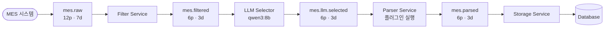
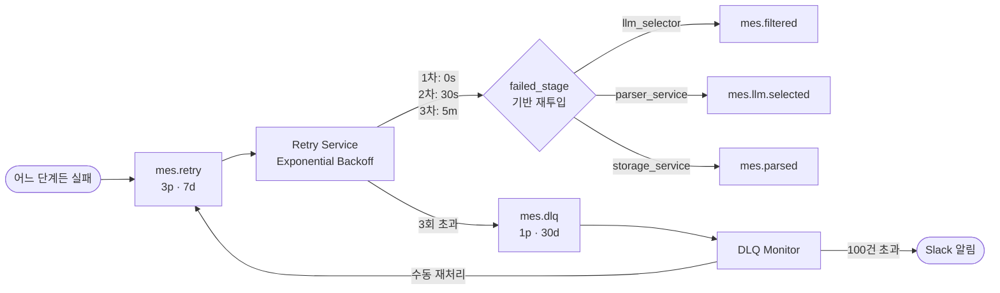

# Kafka MES 파이프라인 전체 플로우

## 정상 경로

## 실패 경로

## 핵심 요약

| 구성 요소 | 역할 | 핵심 설정 |
|---|---|---|
| **Kafka 토픽** | 단계별 메시지 버퍼 | acks=all, idempotence=true |
| **Filter Service** | 불필요 이벤트 제거 | raw 대비 30~50% 감소 |
| **LLM Selector** | parser 이름 분류 | confidence threshold: 0.85 / 0.60 |
| **Parser Service** | subprocess 격리 플러그인 실행 | 핫로딩, timeout=10s |
| **Retry Service** | Exponential Backoff 재시도 | 최대 3회, 단계별 재투입 |
| **DLQ Monitor** | 최종 실패 감시 | 100건 초과 시 Slack 알림 |
