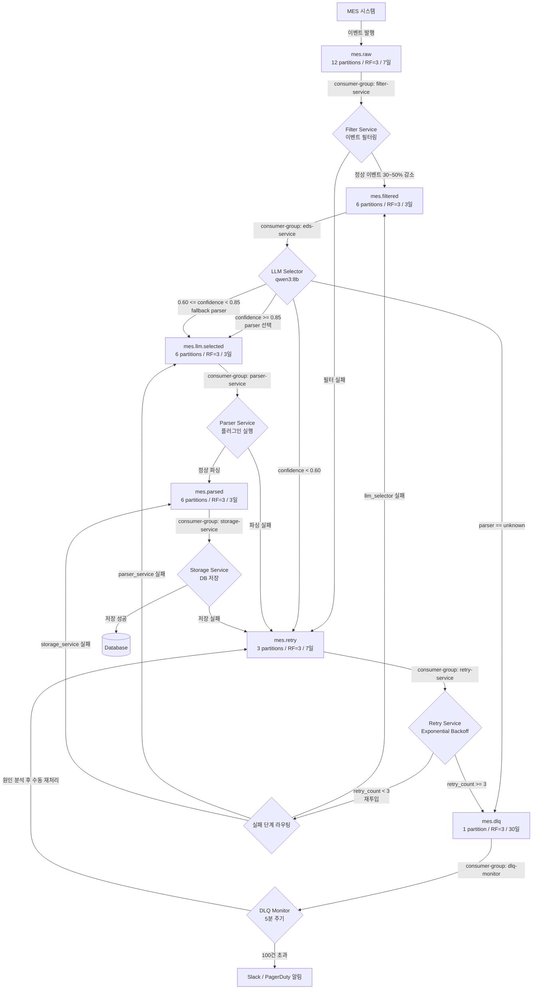
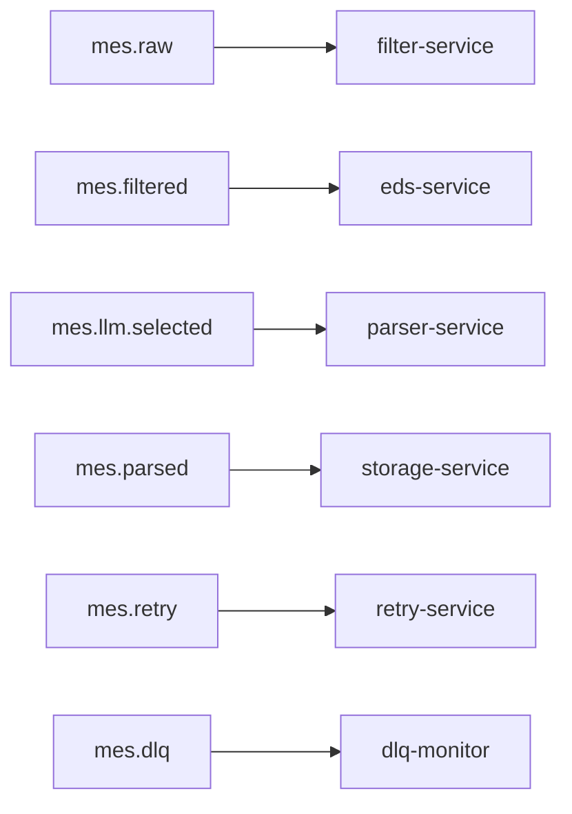
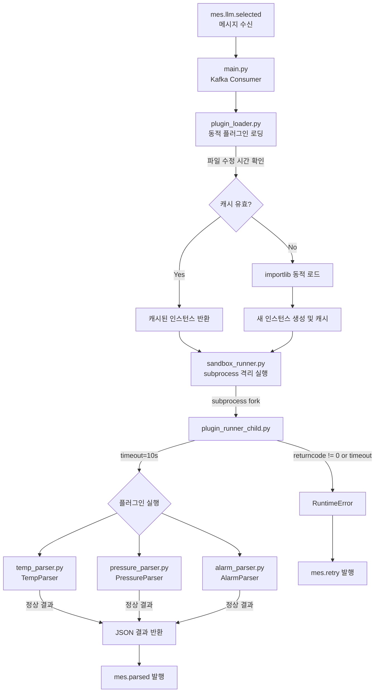
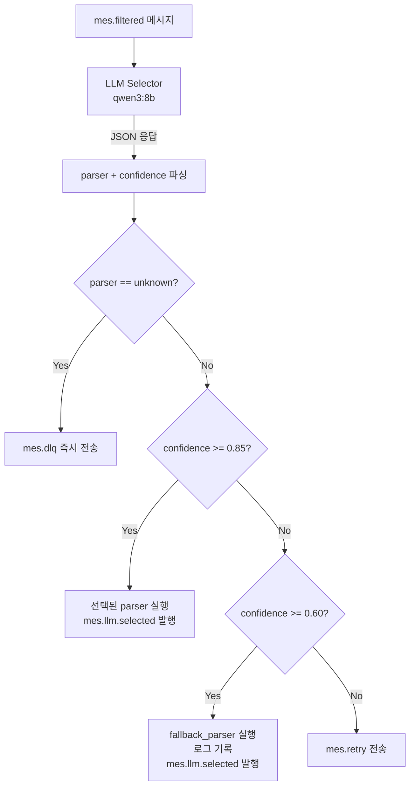
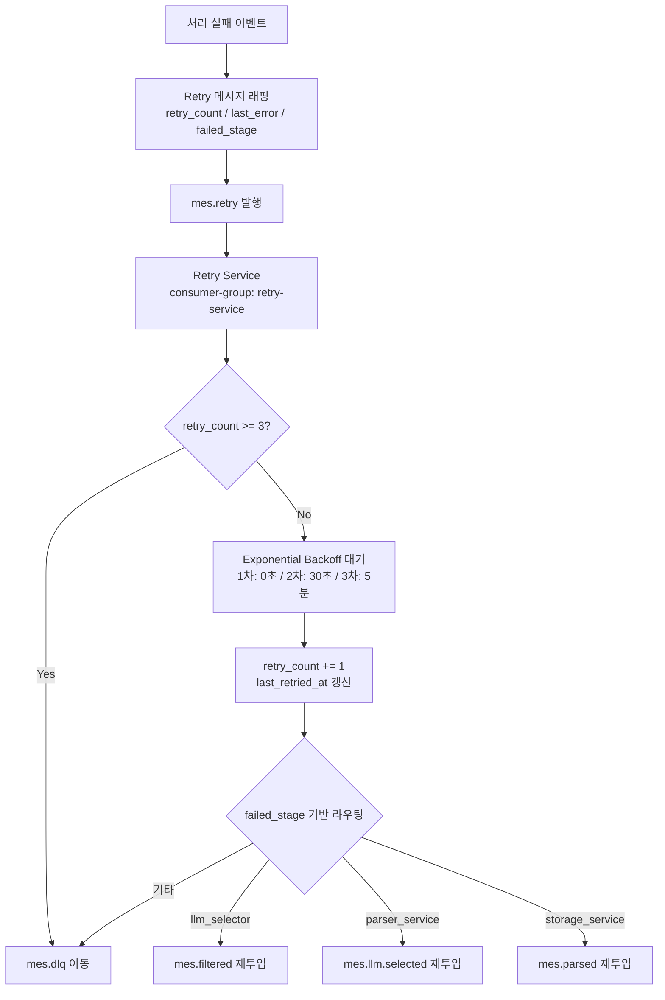
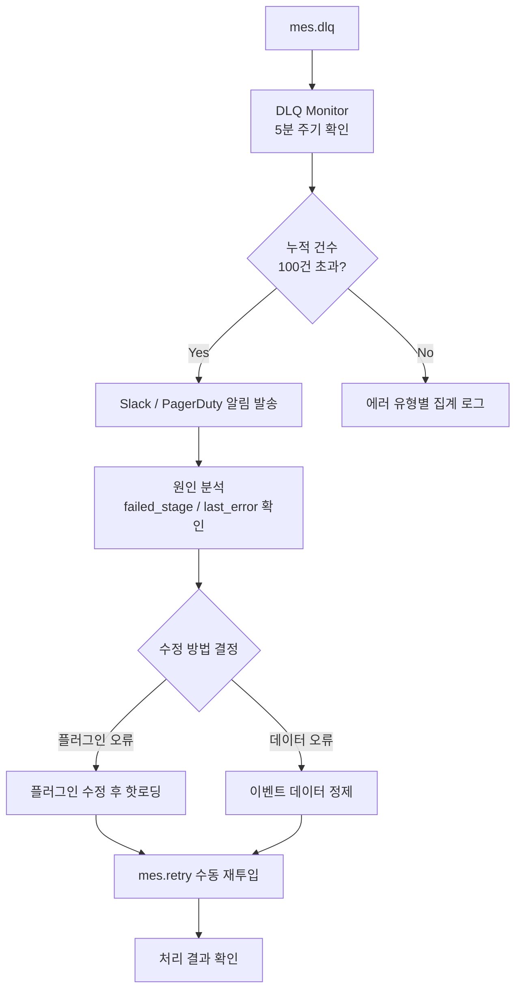
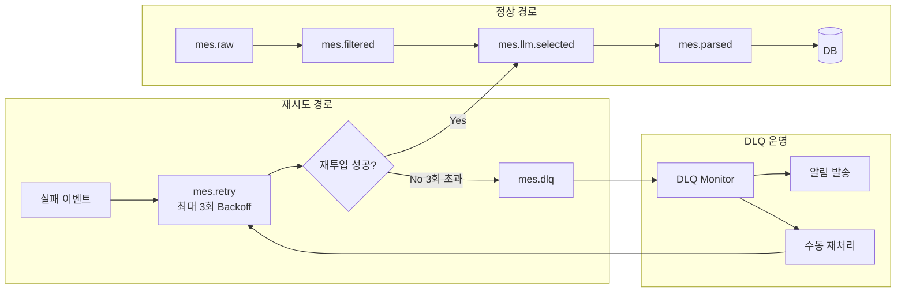

# Kafka MES 파이프라인 전체 설계

## 전체 워크플로우



---

## A. Kafka 토픽 / 파티션 설계

### 토픽별 설계표

| Topic | Partitions | Replication | Retention | 비고 |
|---|---|---|---|---|
| mes.raw | 12 | 3 | 7일 | MES 유입량 최대, 넉넉히 |
| mes.filtered | 6 | 3 | 3일 | raw 대비 30~50% 감소 예상 |
| mes.llm.selected | 6 | 3 | 3일 | filtered와 동일 볼륨 |
| mes.parsed | 6 | 3 | 3일 | 정상 처리 결과 |
| mes.retry | 3 | 3 | 7일 | 재처리 대상, 보존 길게 |
| mes.dlq | 1 | 3 | 30일 | 최종 실패, 장기 보존 |

### Consumer Group 구성



### 파티션 수 결정 기준

```
파티션 수 = 목표 처리량(msg/sec) ÷ 파티션당 처리량(msg/sec)

예시:
- 목표: 6,000 msg/sec
- 파티션당: 500 msg/sec
- 결과: 12 파티션 (mes.raw 기준)
```

### Producer 설정 (유실 방지)

```properties
acks = all
retries = 10
enable.idempotence = true
max.in.flight.requests = 1
```

### Consumer 설정 (수동 commit)

```properties
enable.auto.commit = false
auto.offset.reset = earliest
max.poll.records = 50
```

---

## B. Parser 플러그인 구조

### 플러그인 아키텍처



### 디렉토리 구조

```
parser-service/
├── main.py                  # Kafka consumer + 실행 진입점
├── plugin_loader.py         # 플러그인 동적 로딩
├── base_parser.py           # 추상 인터페이스 정의
├── plugins/
│   ├── temp_parser.py       # 온도 이벤트 파서
│   ├── pressure_parser.py   # 압력 이벤트 파서
│   └── alarm_parser.py      # 알람 이벤트 파서
└── sandbox_runner.py        # subprocess 격리 실행
```

### base_parser.py

```python
from abc import ABC, abstractmethod
from typing import Any

class BaseParser(ABC):

    @abstractmethod
    def parse(self, event: dict) -> dict:
        """
        입력: LLM Selector에서 전달된 원시 이벤트
        출력: 정규화된 결과 dict
        반드시 구현 필요
        """
        pass

    def validate_input(self, event: dict) -> bool:
        """입력 최소 검증 - 필요 시 오버라이드 가능"""
        return "event_id" in event and "payload" in event
```

### temp_parser.py (플러그인 예시)

```python
from base_parser import BaseParser

class TempParser(BaseParser):

    def parse(self, event: dict) -> dict:
        payload = event["payload"]

        return {
            "event_id":   event["event_id"],
            "type":       "temperature",
            "value":      float(payload["temp_value"]),
            "unit":       payload.get("unit", "celsius"),
            "equipment":  payload["equipment_id"],
            "timestamp":  event["timestamp"],
        }

PARSER_CLASS = TempParser
```

### plugin_loader.py (핫로딩)

```python
import importlib
import importlib.util
import os
from base_parser import BaseParser

class PluginLoader:
    def __init__(self, plugin_dir: str = "./plugins"):
        self.plugin_dir = plugin_dir
        self._cache: dict = {}

    def load(self, parser_name: str) -> BaseParser:
        plugin_path = os.path.join(self.plugin_dir, f"{parser_name}.py")

        if not os.path.exists(plugin_path):
            raise FileNotFoundError(f"플러그인 없음: {parser_name}")

        mtime = os.path.getmtime(plugin_path)
        if parser_name in self._cache:
            if self._cache[parser_name]["mtime"] == mtime:
                return self._cache[parser_name]["instance"]

        spec = importlib.util.spec_from_file_location(parser_name, plugin_path)
        module = importlib.util.module_from_spec(spec)
        spec.loader.exec_module(module)

        instance = module.PARSER_CLASS()
        self._cache[parser_name] = {"instance": instance, "mtime": mtime}

        return instance
```

### sandbox_runner.py (subprocess 격리)

```python
import subprocess
import json
import sys

def run_in_sandbox(parser_name: str, event: dict, timeout: int = 10) -> dict:
    payload = json.dumps({"parser": parser_name, "event": event})

    result = subprocess.run(
        [sys.executable, "plugin_runner_child.py"],
        input=payload,
        capture_output=True,
        text=True,
        timeout=timeout,
    )

    if result.returncode != 0:
        raise RuntimeError(f"파서 실패: {result.stderr}")

    return json.loads(result.stdout)
```

---

## C. LLM Selector 정확도 튜닝

### Confidence 기반 라우팅 흐름



### Confidence Threshold 정책

| confidence | parser | 처리 |
|---|---|---|
| >= 0.85 | any | 선택된 parser 실행 |
| 0.60 ~ 0.85 | any | fallback_parser 실행 + 로그 |
| < 0.60 | any | mes.retry 전송 |
| any | unknown | mes.dlq 즉시 전송 |

### 시스템 프롬프트

```
[System Prompt]

당신은 MES 이벤트를 분석하여 적절한 파서를 선택하는 분류기입니다.

규칙:
1. 절대 파싱하지 않습니다
2. 반드시 JSON만 출력합니다
3. parser는 반드시 아래 목록 중 하나여야 합니다:
   - temp_parser
   - pressure_parser
   - alarm_parser
   - unknown (해당 파서 없을 경우)

출력 형식 (이 외 출력 금지):
{
  "parser": "<parser_name>",
  "confidence": <0.0 ~ 1.0>
}
```

### Few-shot 예시

```
[예시 1]
입력: {"event_type": "TEMP_EXCEED", "payload": {"temp_value": 85.3}}
출력: {"parser": "temp_parser", "confidence": 0.97}

[예시 2]
입력: {"event_type": "PRESS_WARN", "payload": {"pressure": 2.1}}
출력: {"parser": "pressure_parser", "confidence": 0.95}

[예시 3]
입력: {"event_type": "ALM_001", "payload": {"code": "E_DOOR"}}
출력: {"parser": "alarm_parser", "confidence": 0.91}

[예시 4]
입력: {"event_type": "UNKNOWN_XYZ", "payload": {}}
출력: {"parser": "unknown", "confidence": 0.30}
```

### LLM Selector 핵심 코드

```python
import json
from ollama import Client

THRESHOLD_HIGH   = 0.85
THRESHOLD_LOW    = 0.60
FALLBACK_PARSER  = "default_parser"

client = Client(host="http://localhost:11434")

def select_parser(event: dict) -> dict:
    prompt = f"""
아래 MES 이벤트에 적합한 파서를 선택하세요.
이벤트: {json.dumps(event, ensure_ascii=False)}
"""
    response = client.chat(
        model="qwen3:8b",
        messages=[
            {"role": "system", "content": SYSTEM_PROMPT},
            {"role": "user",   "content": prompt},
        ],
        format="json",
    )

    result = json.loads(response["message"]["content"])
    parser     = result.get("parser", "unknown")
    confidence = float(result.get("confidence", 0.0))

    if parser == "unknown" or confidence < THRESHOLD_LOW:
        return {"action": "dlq",      "parser": parser, "confidence": confidence}
    elif confidence < THRESHOLD_HIGH:
        return {"action": "fallback", "parser": FALLBACK_PARSER, "confidence": confidence}
    else:
        return {"action": "proceed",  "parser": parser, "confidence": confidence}
```

---

## D. Retry / DLQ 운영 전략

### Retry 흐름



### Retry 메시지 구조

```json
{
  "original_event":  { "...원본 이벤트..." },
  "retry_count":     2,
  "last_error":      "Parser timeout: temp_parser",
  "failed_stage":    "parser_service",
  "first_failed_at": "2025-04-06T10:00:00Z",
  "last_retried_at": "2025-04-06T10:05:00Z"
}
```

### Retry 정책

```
최대 재시도 횟수: 3회
재시도 간격: Exponential Backoff

1회: 즉시 (0초)
2회: 30초 후
3회: 5분 후
3회 초과: mes.dlq 이동
```

### Retry Service 구현

```python
import time
import json
from datetime import datetime
from kafka import KafkaConsumer, KafkaProducer

MAX_RETRY    = 3
BACKOFF_SECS = [0, 30, 300]

def process_retry(message: dict, producer: KafkaProducer):
    retry_count = message.get("retry_count", 0)

    if retry_count >= MAX_RETRY:
        producer.send("mes.dlq", value=json.dumps(message).encode())
        return

    wait = BACKOFF_SECS[retry_count]
    time.sleep(wait)

    message["retry_count"] = retry_count + 1
    message["last_retried_at"] = datetime.utcnow().isoformat()

    target_topic = resolve_retry_topic(message["failed_stage"])
    producer.send(target_topic, value=json.dumps(message).encode())

def resolve_retry_topic(failed_stage: str) -> str:
    routing = {
        "llm_selector":    "mes.filtered",
        "parser_service":  "mes.llm.selected",
        "storage_service": "mes.parsed",
    }
    return routing.get(failed_stage, "mes.dlq")
```

### DLQ 모니터링 흐름



### DLQ 모니터링 코드

```python
from kafka import KafkaConsumer
import requests
import json

DLQ_ALERT_THRESHOLD = 100
SLACK_WEBHOOK_URL    = "https://hooks.slack.com/..."

def monitor_dlq():
    consumer = KafkaConsumer(
        "mes.dlq",
        group_id="dlq-monitor",
        enable_auto_commit=False,
    )

    dlq_count = 0

    for message in consumer:
        dlq_count += 1
        event = json.loads(message.value)

        print(f"[DLQ] stage={event['failed_stage']} "
              f"error={event['last_error']} "
              f"count={dlq_count}")

        if dlq_count % DLQ_ALERT_THRESHOLD == 0:
            send_alert(f"DLQ 누적 {dlq_count}건 발생 - 확인 필요")

def send_alert(message: str):
    requests.post(SLACK_WEBHOOK_URL, json={"text": message})
```

---

## 전체 정상/실패 경로 요약



---

## 다음 단계 옵션

| 옵션 | 내용 |
|---|---|
| **E** | 각 MSA 서비스 Docker Compose 구성 |
| **F** | LLM Selector 실제 Ollama 연동 코드 완성 |
| **G** | CLAUDE.md 작성 (Claude Code 자율 구현용) |
