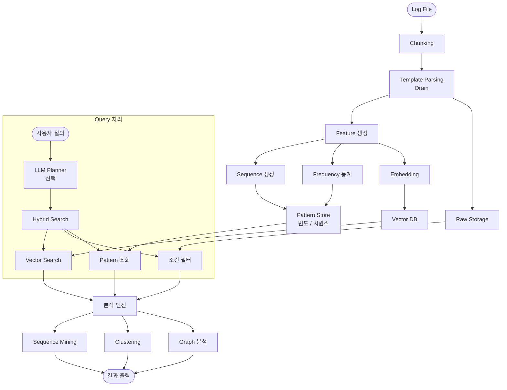
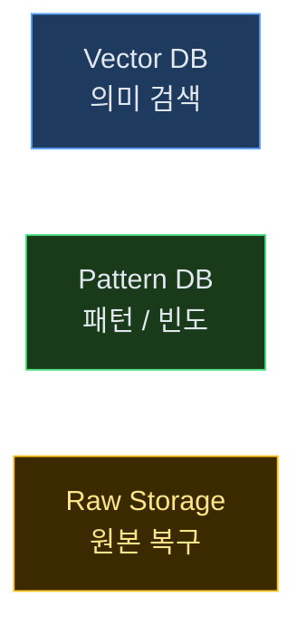
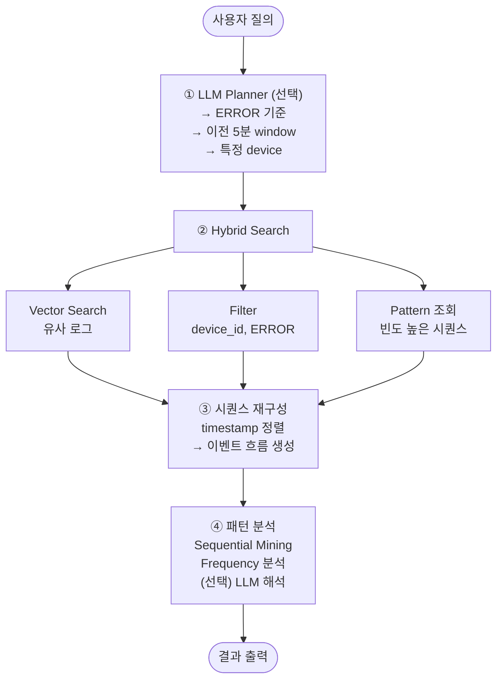
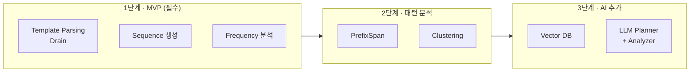
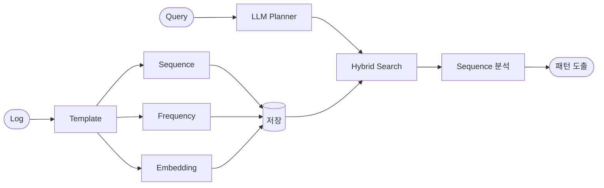

# 정적 로그 패턴 탐지 시스템 — 실전 설계

---

## 1. 전체 최종 아키텍처



---

## 2. 핵심 설계 포인트

### ① 입력 처리 (가장 중요)

```
Log → Chunk → Template 추출
```

> 반드시 **Template 기반**으로 변환해야 한다.
> Raw 로그 그대로는 패턴 탐지 불가능.

---

### ② Feature Layer (여기서 승부 남)

3가지를 **동시에** 생성한다.

| Feature | 예시 | 용도 |
|---|---|---|
| **Sequence** | `[A, B, C, ERROR]` | 이벤트 흐름 분석 |
| **Frequency** | `A: 1200회 / ERROR: 3회` | 이상 빈도 탐지 |
| **Embedding** | 벡터 변환 | 의미 기반 유사 검색 |

---

### ③ 저장 구조 (분리 필수)



> **이 3개를 하나로 합치면 성능이 망가진다.**

---

## 3. Query 처리 구조

**입력 예시**
```
"장애 발생 전 공통 패턴 찾아줘"
```



---

## 4. 패턴 탐지 엔진

### 구조

```
Sequence 데이터
 → PrefixSpan (시퀀스 패턴)
 → 빈도 분석
 → 이상 패턴 탐지
```

### 결과 예시

```
정상 패턴:
  A → B → C

이상 패턴:
  A → B → X → ERROR
```

---

## 5. 3단계 구현 전략



| 단계 | 내용 | 효과 |
|---|---|---|
| **1단계 MVP** | Drain + Sequence + Frequency | 전체 문제의 **70% 해결** |
| **2단계** | PrefixSpan + Clustering | 고급 패턴 탐지 |
| **3단계** | Vector DB + LLM | AI 기반 자동 분석 |

---

## 6. 기술 스택

| 영역 | 기술 |
|---|---|
| **로그 파싱** | Drain3 (Python) |
| **패턴 분석** | prefixspan, pandas |
| **Vector DB** | FAISS / Qdrant |
| **저장소** | PostgreSQL / ClickHouse |

---

## 7. 핵심 설계 철학

> **1. 로그 = 텍스트가 아니라 이벤트다**
> **2. 패턴 = 단어가 아니라 시퀀스다**
> **3. 분석 = 검색이 아니라 구조화다**

---

## 8. 최종 압축 플로우



---

## 9. 한 줄 결론

> **"Template 기반으로 로그를 이벤트화하고, 시퀀스/빈도/벡터를 결합해 패턴을 찾는 하이브리드 구조가 최적"**

---

## 다음 단계

```
Python 최소 구현 (바로 실행 가능)
  → Drain3  (Template Parsing)
  → PrefixSpan  (Sequence Pattern Mining)
  → FAISS  (Vector Search)
```
